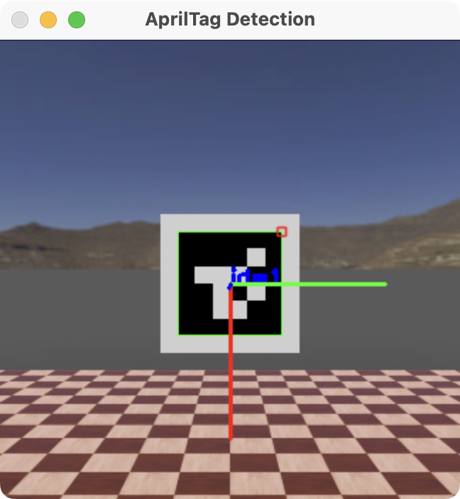
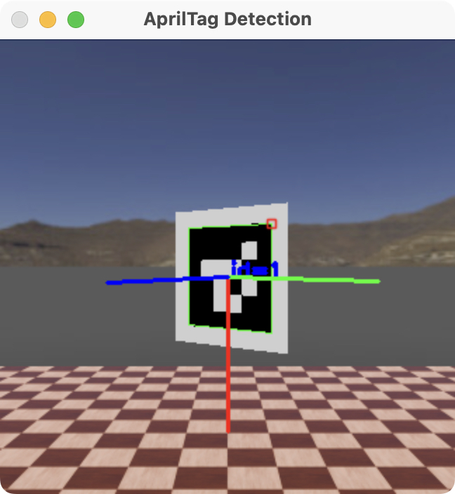

# Crazyflie AprilTag Tracking In Webots Simulator

This project shows using a Bitcraze Crazyflie drone in the Webots simulator 
to track and move towards AprilTag markers using OpenCV.
Originally, this project was supposed to be done on actual hardware, 
but after a series of technical issues, it was done in simulator instead ☹️.

> [!NOTE]
> ### 🚧 UNDER CONSTRUCTION 🚧
> Actually following the AprilTag is currently not working. 
> The drone can detect it and its orientation, but does not currently move accordingly.


## Quickstart
If you're just interested in running the project, see these Quickstart details. 
Otherwise, the rest of this README is dedicated to walking through the process of creating the project.
<details><summary>Quickstart</summary>
These instructions will get you up and running with this project quickly so you can see it working.
Read the rest of the README if you want to understand how it works.

Make sure you've installed
1. [Webots](https://www.cyberbotics.com/doc/guide/installation-procedure)
2. Python

Clone the project.
```shell
git clone https://github.com/BruceMcRooster/crazyflie-apriltag-tracking.git
cd crazyflie-apriltag-tracking
```

Next, install the Python dependencies for the project.
I recommend first creating a virtual environment, but you can do it without one.

<details><summary>Creating a Python virtual environment</summary>
First, create the virtual environment.
```shell
python3 -m venv ./.venv
```
Then activate it for your shell. 
All Python commands you execute will be run in this virtual environment,
keeping your global installation clean of dependencies.
Several different activation scripts will be created, so choose the one that's right for your shell.

**Bash/Zsh**
```shell
source ./.venv/bin/activate
```
**Fish**
```shell
source ./.venv/bin/activate.fish
```
Then continue the dependency installation with this activated.
If you ever need to close the terminal, reactivate by running the `source` command again.

To deactivate this virtual environment, run `deactivate`.
</details>

Run this to install all the dependencies you'll need.
```shell
pip install -r requirements.txt
```

Next, open Webots.

If you have not used Python in Webots before, you might need to set it up.
Follow [these](https://cyberbotics.com/doc/guide/using-python) instructions. 
If you created a virtual environment for the project in the previous step, 
you can point to the Python executable in the .venv folder from the settings window.

```/path/to/crazyflie-apriltag-tracking/.venv/bin/python```

Finally, open the world (`path/to/crazyflie-apriltag-tracking/worlds/world.wbt`) in Webots and hit run.
If you focus on the screen, you should be able to move the AprilTag.
Arrows keys move the AprilTag side to side, W and S move it up and down, and Q and E rotate it.
The drone should track this movement accordingly, or start looking for it if it loses tracking.

</details>

## Setup
Before you get started on making your own Crazyflie drone track AprilTags, you'll need to do some setup.

### Install Tools
First, make sure you've installed Python (version 3.8 or higher) and [Webots](https://www.cyberbotics.com/doc/guide/installation-procedure),
which is the simulator we'll be using.

### Create A Project
Create a folder for this project.

Next, we'll create a basic Webots project.
Create 2 folders in your project file: `controllers` and `worlds`.

Inside `worlds`, create a file called `world.wbt`, and paste the contents of 
[this](https://github.com/BruceMcRooster/crazyflie-apriltag-tracking/blob/241355c74062701479ea734ecbaa26e922c0252f/worlds/world.wbt)
file into it.

Inside `controllers`, create a folder called `drone_controller`.
Inside that, create two files: `drone_controller.py` and `pid_controller.py`.
Copy [this](https://github.com/BruceMcRooster/crazyflie-apriltag-tracking/blob/241355c74062701479ea734ecbaa26e922c0252f/controllers/drone_controller/drone_controller.py)
code into `drone_controller.py` and [this](https://github.com/BruceMcRooster/crazyflie-apriltag-tracking/blob/241355c74062701479ea734ecbaa26e922c0252f/controllers/drone_controller/pid_controller.py)
code into `pid_controller.py`.

These three files are a combination of example code included in Webots by Bitcraze, the makers of the Crazyflie drone.
You can find the two starter projects they were drawn from in the "File > Open Sample World..." menu in Webots,
under "robots > bitcraze > crazyflie". 
The Python code is a modification of the code from the `crazyflie_apartment.wbt` project,
and the world file is a modification of the code from the `crazyflie.wbt` project.

If you open the Webots simulator and open the `world.wbt` file you created, you should see this.


You'll also probably see an error in the console window. That's where the next part comes in.

### Install Dependencies
The Python script you just created depends on a library. 
We need to install that library to be able to use it.

For this project, I recommend creating a virtual environment, 
which will keep all the dependencies we need separate from the rest of your Python installation.
You don't need one, but I highly recommend creating one. 
You can skip the next section if you don't want one.

#### Create A Python Virtual Environment
Open your project folder[^1] in a terminal and run the following command.
```shell
python3 -m venv ./.venv
```
This will create a new virtual Python environment. 
To activate it in your terminal so you can install things, run this if you use Bash or Zsh
```shell
source ./.venv/bin/activate
```
or this if you use Fish Shell
```shell
source ./.venv/bin/activate.fish
```
If you don't know which one you use, run the first command; it'll probably be the right one. 
If you use another shell, the `.venv/bin` folder contains several other activation scripts for various shells.
You can probably find the one you need.

Whenever you want to work on this project in the terminal, you'll want to run that `source` command again.
That will make sure all the things you install are available to your code.

[^1]: You can actually put your virtual environment anywhere and name it anything, 
but I like to keep my virtual environment with my project.

#### Install NumPy
The library we need to get the drone flying is called NumPy. 
You can install by running this command (with your virtual environment activated, if you have one).
```shell
pip install numpy
```

#### Set Up Webots With Python
Now that you've installed that, Webots needs to have access to it.
If you didn't use a virtual environment, it may already work, 
but you can be certain by telling Webots where to look for your Python executable.

Go back to Webots. Open the Preferences window (⌘+, on macOS, Tools > Preferences on other platforms).

In the General tab, you'll find a field labeled "Python command." 
In it, enter `/path/to/your/project/folder/.venv/bin/python`, substituting the absolute path to your project.
If you put your virtual environment somewhere else, modify this path to reflec that.
If you didn't use a virtual environment at all, [this page](https://cyberbotics.com/doc/guide/using-python)
should give you some guidance on what to put here.

With that, you should be able to reload the project (the button with two arrows in a circle on the top toolbar)
and see your drone lift off. You should also be able to control it with your keyboard.

### Set Up An IDE
You can work directly in Webots on this project. 
In the side panel with a list of objects, click on the arrow next to 'Crazyflie "Crazyflie"',
select `controller`, and press Edit in the menu that appears below.

If you want to set up a different Python IDE for editing your project, [this page](https://cyberbotics.com/doc/guide/using-your-ide)
has info on setting up various IDEs. I also included instructions for PyCharm, which I personally used.
<details><summary><b>PyCharm</b></summary>
In the main settings window, under "Project: [Your Project Name]", select "Python Interpreter".
Hit "Add Interpreter > Add Local Interpeter...". Then click "Select existing" 
and set the "Python path" to `/path/to/your/virtual_environment/bin/python`.

After that go watch (and give a like to) [this video](https://www.youtube.com/watch?v=t6ZSB5cGZdQ&t=225)
that someone made on the full setup process. I found it useful through to about the 7-minute mark.
It is done for macOS, but it's likely a similar process on other platforms.

If you prefer to read, it is almost identical to the [aforementioned setup page](https://cyberbotics.com/doc/guide/using-your-ide#pycharm).
</details>

<details><summary><b>Emacs</b></summary>
Sorry Chris, I'm not figuring out how to make this one work just for you.
</details>

Give yourself a pat on the back. You've just finished all the setup you'll need.

## Create The AprilTag
AprilTags are an amazing little creation by the APRIL Robotics Laboratory that are like special QR codes for robots.
They're super easy and fast to track with a camera, even in 3D. If you're interested, you can learn more [here](https://april.eecs.umich.edu/software/apriltag).
I also find [this](https://docs.wpilib.org/en/stable/docs/software/vision-processing/apriltag/apriltag-intro.html) 
page in the FIRST Robotics WPILib Docs to be quite informative.
This will be what our drone tracks when flying.


For the drone to track an AprilTag, it needs an AprilTag to track.

### Get An AprilTag
Go to [this](https://github.com/AprilRobotics/apriltag-imgs/tree/master/tag16h5) folder and choose an AprilTag.
The ID of each AprilTag is given in the last part of the file name (`tag16_05_[tag_id].png`).
You can choose any of these; just remember which tag you got.

When you click on the file, it will show a tiny preview. This is the actual size of the image, 
since they are scaled down to be just one pixel per square, resulting in an 8 pixel by 8 pixel image.
Download the one you chose using the download button.

Move this image to your `worlds` folder. 
I renamed mine to be something more typeable ([`apriltag1.png`](worlds/apriltag1.png)), but you don't have to.

### Insert The AprilTag
Now, we need to get it into our world.
Open up Webots. Make sure you pause and reset your simulation using the controls at the top of the window.
This takes several steps, so be patient, and go slowly.
> [!WARNING]
> Make sure that your drone is not currently flying and the time marker says 0:00:00:000.
> Otherwise, you won't be able to save your changes without overwriting the initial drone position. 

<details><summary>If you aren't patient, you can copy the final output here.</summary>

Copy this into the bottom of your `world.wbt` file

```
Robot {
  translation 0.5 0 1
  children [
    Solid {
      rotation 0 1 0 -1.5708
      children [
        Shape {
          appearance Appearance {
            texture ImageTexture {
              url [
                "[apriltag name].png"
              ]
              filtering 0
            }
          }
          geometry Plane {
            size 0.133333 0.133333
          }
        }
      ]
    }
  ]
  name "AprilTag"
}
```
Replace `[apriltag name]` with the name of your AprilTag image.

You can then reload your simulator (arrows in a circle icon) to see these changes.

---
</details>

1. Click on the plus button on the side menu showing all the world objects.
   Select "Base nodes > Robot" and hit Add.
2. Find that Robot in the sidebar. Expand its properties and scroll down to its "name" property.
   Change that to "AprilTag."
3. Find the "children" property on the Robot. Double-click on it to add a child.
   Find a "Solid" under "Base nodes" and add that.
4. Double-click the "children" property to add a "Shape" node (also under "Base nodes"; everything we're adding is) as a child of the Solid.
5. Add a "Plane" to the Shape node's "geometry" property.
   You should now see something gray flickering in the floor of the world.
6. Add an "Appearance" node to the Shape's "appearance" property.
7. Add an "ImageTexture" node to the Appearance's "texture" property.
8. Double-click on the ImageTexture's "url" property. 
   In the field that appears, type the name of the AprilTag you saved, including the .png extension.
   You should now see a blurry black and white image flickering in the floor.
9. Find the "rotation" property on the Shape node.
   Set the "y" property to 1 and the "x" and "z" properties to 0.
   Then set the "angle" property to -1.5708. 
   You should now see a blurry image of your AprilTag standing upright.
   If you right-click on the Solid and select "Move Viewpoint to Object", you can get a better view.
10. To solve the blurring problem, go back to the Image node and set its "filtering" property to 0.
    This will turn off smoothing of the PNG image, and you should now see your AprilTag in crisp detail.
11. Set the Plane's "size" property to x=0.133333 and y=0.133333. 
    This will make the inner part of the AprilTag 10 cm by 10 cm.
12. Go up to the Robot at the root named "AprilTag" and set it's "translation" property to x=0.5, y=0.0, z=1.0.
    This will position it about half a meter in front of the drone once it launches.

> [!WARNING]
> Make sure to save your changes using the save menu before doing anything else in the simulator.

Then, you can hit play and launch your drone.
It should come to rest with the AprilTag roughly centered in its camera window.


### Code The AprilTag
To make testing more interesting, this AprilTag will be able to move using keyboard controls 
so you can test the drone tracking it.

First, create a new folder called `apriltag_controller` in your `controllers` folder. 
This will store the code to implement these controls.

Next, create a new file in that folder called `apriltag_controller.py`.
As far as I can tell, controllers need to have the same name as their enclosing folder.

You can then copy the code in [this file](controllers/apriltag_controller/apriltag_controller.py).
It's heavily commented if you want to understand how it works, but generally not relevant to making this all work.

Finally, we need to wire up this controller with the AprilTag. Go back to Webots.
*Make sure* you've reset your simulation so you can make changes.
Then change two things in your "AprilTag" Robot.
1. Set the "controller" property to "apriltag_controller." The option should show up if you hit the Select button.
2. Set "supervisor" to TRUE. This allows the controller code to directly manipulate the simulations,
   which it needs to do to work.

If you save your changes and run the simulation, 
you should now be able to control the position of the AprilTag with similar controls to those of the Crazyflie.
Your Crazyflie may simultaneously be reacting to the keyboard inputs, because it's still set to use those controls.
Let's make it fly itself instead!

## Track The AprilTag
The first step to tracking the AprilTag is being able to detect it, 
including finding its distance and rotation relative to the drone.

### Install OpenCV
First, we'll need to import another library that will help us with image processing.
OpenCV is the open-source industry standard for image processing in robotics.

Reactivate your virtual environment if you have one. 
Then run
```shell
pip install opencv_python
```

### Create An AprilTagDetector Class
To keep all the code we'll need for detecting the AprilTag separate from the drone flying code,
we'll create a new class. Create a new file in `controllers/drone_controller` called `apriltag_detector.py`.
Then paste in the following code.

```python
from controller import Camera

class AprilTagDetector:
    def __init__(self, camera: Camera):
        self.camera = camera
```

This will let us initialize the AprilTag detector with a camera it can read images from.

### Read Images From The Camera
Next, we'll need a way to actually read those images.
We'll put all these pieces together at the end in one function,
so we'll separate this logic into a private function on the class.

First, we'll need to import NumPy and OpenCV.
```python
import cv2
import numpy as np

from controller import Camera

...
```
Next, we'll create a class function `_get_camera_image`
```python
def _get_camera_image(self):
```
In that function, we'll need to do two things. 
First, we need to get the image from the camera buffer.
```python
img = np.frombuffer(self.camera.getImage(), dtype=np.uint8).reshape((self.camera.height, self.camera.width, 4))
```
This code read the camera image buffer into a NumPy array, then converts it to a matrix that is the size of the camera,
which is the structure of images that OpenCV works with.

Next, since the data output from the camera is in the BGRA format, but OpenCV works in the BGR format,
we'll convert the structure of the data in the image matrix.
```python
img_converted = cv2.cvtColor(img, cv2.COLOR_BGRA2BGR)
```
Finally, we can return that converted image. The full function will look like this.

```python
def _get_camera_image(self):
    img = np.frombuffer(self.camera.getImage(), dtype=np.uint8).reshape((self.camera.height, self.camera.width, 4))
    img_converted = cv2.cvtColor(img, cv2.COLOR_BGRA2BGR)
    return img_converted
```

<details>
<summary>Current Full File</summary>

```python
import cv2
import numpy as np

from controller import Camera

class AprilTagDetector:
    def __init__(self, camera: Camera):
        self.camera = camera

    def _get_camera_image(self):
        img = np.frombuffer(self.camera.getImage(), dtype=np.uint8).reshape((self.camera.height, self.camera.width, 4))
        img_converted = cv2.cvtColor(img, cv2.COLOR_BGRA2BGR)
        return img_converted
```
</details>

### Find AprilTag In Image
To detect an AprilTag, we'll need to configure OpenCV's ArUco marker capabilities.

First, we'll need on more import
```python
from cv2 import aruco as aruco
```
We'll set up the detector in our `__init__` method to avoid recreating it several times a second.
We'll get the dictionary that contains the information OpenCV needs to recognize our AprilTag family.
```python
apriltag_dict = aruco.getPredefinedDictionary(aruco.DICT_APRILTAG_16h5)
```
Next, we'll configure the parameters for the detector and create the detector. 
We don't need anything beyond the default configuration.
We'll make the detector a new class property to let us access it later on.
```python
parameters = aruco.DetectorParameters()
self.detector = aruco.ArucoDetector(apriltag_dict, parameters)
```
Next, we'll create a function to detect an AprilTag in an image. 
Since we can only ever detect one to follow, we'll choose the one with the lowest ID that we see.
```python
def _get_min_id_apriltag(self, image):
```
We can use the detector to detect AprilTags in the image.
```python
corners, ids, rejected_image_points = self.detector.detectMarkers(image)
```
This will get us the corner points (relative to the image) and IDs of the AprilTags that were detected.
Next, we'll get the lowest ID and return the ID and corners.
```python
if ids is None or len(ids) == 0: # We didn't detect any markers
    return None, None

min_index = int(np.argmin(ids)) # Gets the index of the smallest ID

return int(ids[min_index]), corners[min_index]
```

<details>
<summary>Current Full File</summary>

```python
import cv2
from cv2 import aruco as aruco
import numpy as np

from controller import Camera

class AprilTagDetector:
    def __init__(self, camera: Camera):
        self.camera = camera
        
        apriltag_dict = aruco.getPredefinedDictionary(aruco.DICT_APRILTAG_16h5)
        parameters = aruco.DetectorParameters()
        self.detector = aruco.ArucoDetector(apriltag_dict, parameters)
        

    def _get_camera_image(self):
        img = np.frombuffer(self.camera.getImage(), dtype=np.uint8).reshape((self.camera.height, self.camera.width, 4))
        img_converted = cv2.cvtColor(img, cv2.COLOR_BGRA2BGR)
        return img_converted

    def _get_min_id_apriltag(self, image):
        corners, ids, rejected_image_points = self.detector.detectMarkers(image)
        
        if ids is None or len(ids) == 0: # We didn't detect any markers
            return None, None

        min_index = int(np.argmin(ids)) # Gets the index of the smallest ID
        
        return int(ids[min_index]), corners[min_index]
```
</details>

### Find Orientation Of AprilTag
Next, we'll use OpenCV again to determine the orientation of the AprilTag we detected.
We'll need to put a little more configuration in our `__init__` method 
to give the orientation detector all the information it needs.

First, the detector needs the focal length of the camera.
Unfortunately, the built-in `Camera.getFocalLength()` will return 0 for our simulator camera,
since it doesn't have a focal length configured.
We can get around this by computing the focal length a different way 
using the field of view (FOV) and the dimensions of the camera image.
We'll need to compute the focal length in both the x and y axes. 
These will end up being equal because the camera frame is square.
```python
fx = (self.camera.width / 2) / (self.camera.fov / 2)
fy = fx
```
You can learn more about FOV and focal length in Webots [here](https://www.cyberbotics.com/doc/reference/camera#field-summary)

Next, we'll need the location, in pixels, of the center of focus in the image.
This is just the center of the image, so we can compute it easily.
```python
cx = self.camera.width / 2
cy = self.camera.height / 2
```
Finally, we'll put these together into a matrix which the detector can interpret.
We'll make it a class property to access it later.
```python
self.camera_matrix = np.array([[fx, 0, cx],
                               [0, fy, cy],
                               [0, 0, 1]], dtype=np.float32)
```
We'll also create a class property to store the length of the sides of the markers.
Remember we set the size of our marker so that the width of the black part was 10 centimeters.
```python
self.marker_length = 0.1
```

Now that we've configured this in our initializer, we can use it in a new function 
that will take the corners of a detected AprilTag and determine its orientation.
```python
def _get_apriltag_orientation(self, corners):
```
We'll create a matrix that tells OpenCV how the corners of the marker are situated relative to its center.
```python
obj_points = np.array([[-self.marker_length / 2.0, self.marker_length / 2.0, 0],
                       [self.marker_length / 2.0, self.marker_length / 2.0, 0],
                       [self.marker_length / 2.0, -self.marker_length / 2.0, 0],
                       [-self.marker_length / 2.0, -self.marker_length / 2.0, 0]],
                      dtype=np.float32)
```
Then, we can get the solved rotation and translation vectors and return them.
```python
_, rvec, tvec = cv2.solvePnP(
    objectPoints=obj_points,
    imagePoints=corners,
    cameraMatrix=self.camera_matrix,
    distCoeffs=None # We have no distortion in the camera
)

return rvec, tvec
```

<details>
<summary>Current Full File</summary>

```python
import cv2
from cv2 import aruco as aruco
import numpy as np

from controller import Camera

class AprilTagDetector:
    def __init__(self, camera: Camera):
        self.camera = camera
        
        apriltag_dict = aruco.getPredefinedDictionary(aruco.DICT_APRILTAG_16h5)
        parameters = aruco.DetectorParameters()
        self.detector = aruco.ArucoDetector(apriltag_dict, parameters)
        
        fx = (self.camera.width / 2) / (self.camera.fov / 2)
        fy = fx

        cx = self.camera.width / 2
        cy = self.camera.height / 2

        self.camera_matrix = np.array([[fx, 0, cx],
                                  [0, fy, cy],
                                  [0, 0, 1]], dtype=np.float32)

        self.marker_length = 0.1

    def _get_camera_image(self):
        img = np.frombuffer(self.camera.getImage(), dtype=np.uint8).reshape((self.camera.height, self.camera.width, 4))
        img_converted = cv2.cvtColor(img, cv2.COLOR_BGRA2BGR)
        return img_converted

    def _get_min_id_apriltag(self, image):
        corners, ids, rejected_image_points = self.detector.detectMarkers(image)
        
        if ids is None or len(ids) == 0: # We didn't detect any markers
            return None, None

        min_index = int(np.argmin(ids)) # Gets the index of the smallest ID
        
        return int(ids[min_index]), corners[min_index]

    def _get_apriltag_orientation(self, corners):

        obj_points = np.array([[-self.marker_length / 2.0, self.marker_length / 2.0, 0],
                               [self.marker_length / 2.0, self.marker_length / 2.0, 0],
                               [self.marker_length / 2.0, -self.marker_length / 2.0, 0],
                               [-self.marker_length / 2.0, -self.marker_length / 2.0, 0]],
                              dtype=np.float32)

        _, rvec, tvec = cv2.solvePnP(
            objectPoints=obj_points,
            imagePoints=corners,
            cameraMatrix=self.camera_matrix,
            distCoeffs=None # We have no distortion in the camera
        )

        return rvec, tvec
```
</details>

### Put It Together
Finally, we can create a final function to bring all these functions together.
This will be what we call in our drone.
```python
def get_min_tag_offset(self):
    image = self._get_camera_image()
    
    tag_id, corners = self._get_min_id_apriltag(image)
    if tag_id is None or corners is None: # No detections
        return None, None

    rvec, tvec = self._get_apriltag_orientation(corners)

    return rvec, tvec
```
This is everything we'll need.
But for debugging purposes, let's add an image readout of the detection.
Fortunately, OpenCV makes this really easy.

We'll add a new argument to the function to indicate whether to show a debug window.
```python
def get_min_tag_offset(self, show_detection_window = False):
```
Then, if that argument is true, we'll show the detection right before we return.

```python
import cv2

...
rvec, tvec = self._get_apriltag_orientation(corners)

### New code ###
if show_detection_window:
    # Highlight and label the AprilTag we saw
    aruco.drawDetectedMarkers(image, [corners], np.array([tag_id]))
    # Draw its orientation markers
    cv2.drawFrameAxes(
        image=image,
        cameraMatrix=self.camera_matrix,
        distCoeffs=None,
        rvec=rvec,
        tvec=tvec,
        length=self.marker_length * 1.5,
        thickness=2
    )
    # Show the image in a window
    cv2.imshow('AprilTag Detection', image)
    cv2.waitKey(100)
### End new code ###

return rvec, tvec
```

<details>
<summary>Final Full File</summary>

```python
import cv2
from cv2 import aruco as aruco
import numpy as np

from controller import Camera

class AprilTagDetector:
    def __init__(self, camera: Camera):
        self.camera = camera
        
        apriltag_dict = aruco.getPredefinedDictionary(aruco.DICT_APRILTAG_16h5)
        parameters = aruco.DetectorParameters()
        self.detector = aruco.ArucoDetector(apriltag_dict, parameters)
        
        fx = (self.camera.width / 2) / (self.camera.fov / 2)
        fy = fx

        cx = self.camera.width / 2
        cy = self.camera.height / 2

        self.camera_matrix = np.array([[fx, 0, cx],
                                  [0, fy, cy],
                                  [0, 0, 1]], dtype=np.float32)

        self.marker_length = 0.1

    def _get_camera_image(self):
        img = np.frombuffer(self.camera.getImage(), dtype=np.uint8).reshape((self.camera.height, self.camera.width, 4))
        img_converted = cv2.cvtColor(img, cv2.COLOR_BGRA2BGR)
        return img_converted

    def _get_min_id_apriltag(self, image):
        corners, ids, rejected_image_points = self.detector.detectMarkers(image)
        
        if ids is None or len(ids) == 0: # We didn't detect any markers
            return None, None

        min_index = int(np.argmin(ids)) # Gets the index of the smallest ID
        
        return int(ids[min_index]), corners[min_index]

    def _get_apriltag_orientation(self, corners):

        obj_points = np.array([[-self.marker_length / 2.0, self.marker_length / 2.0, 0],
                               [self.marker_length / 2.0, self.marker_length / 2.0, 0],
                               [self.marker_length / 2.0, -self.marker_length / 2.0, 0],
                               [-self.marker_length / 2.0, -self.marker_length / 2.0, 0]],
                              dtype=np.float32)

        _, rvec, tvec = cv2.solvePnP(
            objectPoints=obj_points,
            imagePoints=corners,
            cameraMatrix=self.camera_matrix,
            distCoeffs=None # We have no distortion in the camera
        )

        return rvec, tvec
    
    def get_min_tag_offset(self, show_detection_window=False):
        image = self._get_camera_image()
        
        tag_id, corners = self._get_min_id_apriltag(image)
        if tag_id is None or corners is None: # No detections
            return None, None
    
        rvec, tvec = self._get_apriltag_orientation(corners)
    
        if show_detection_window:
            # Highlight and label the AprilTag we saw
            aruco.drawDetectedMarkers(image, [corners], np.array([tag_id]))
            # Draw its orientation markers
            cv2.drawFrameAxes(
                image=image,
                cameraMatrix=self.camera_matrix,
                distCoeffs=None,
                rvec=rvec,
                tvec=tvec,
                length=self.marker_length * 1.5,
                thickness=2
            )
            # Show the image in a window
            cv2.imshow('AprilTag Detection', image)
            cv2.waitKey(100)
        
        return rvec, tvec
```
</details>

Now we can update our drone code to detect the AprilTag.

We'll import the detector we just made.
```python
from apriltag_detector import AprilTagDetector
```
Then we'll initialize it once we've initialized our camera.
```python
...
camera = robot.getDevice("camera")
detector = AprilTagDetector(camera)
...
```
Finally, in our main loop, we'll read out the variables from it.
```python
rvec, tvec = detector.get_min_tag_offset(True)
```
For now, we'll pass `True` to tell it show the debug window.
As you'll see in a second, though, this causes a major performance hit in the simulator,
so you shouldn't keep this on all the time.

If you go back to Webots and run the simulator, a window should appear (it might be hidden behind the simulator).
It will look something like this once the drone stabilizes.

If you rotate the AprilTag using the keyboard controls (Q and E), you'll see the orientation change.

You can continue moving the AprilTag around, including away from the camera, and the detection should keep up.

Once you're done checking this out, set the parameter in `detector.get_min_tag_offset` to `False` 
to make the simulator run more smoothly. You can see the current speed in the top bar,
and it typically drops to about quarter speed when displaying the window.
You can always turn it back on if you need to see what's going on.

Now that we can track the AprilTag with the camera,
the last part of the puzzle is to make the drone autonomously move to keep itself a certain distance from the AprilTag.
That's what we'll do next.

## Follow The AprilTag
> [!WARNING]
> ### 🚧 UNDER CONSTRUCTION 🚧
> This section is currently incomplete. It will be updated once the tracking part of this project is completed.

## Future Directions
- [ ] Search for AprilTags is none are found
- [ ] Move to AprilTags in order (find and move to ID 0, the ID 1, and so on)